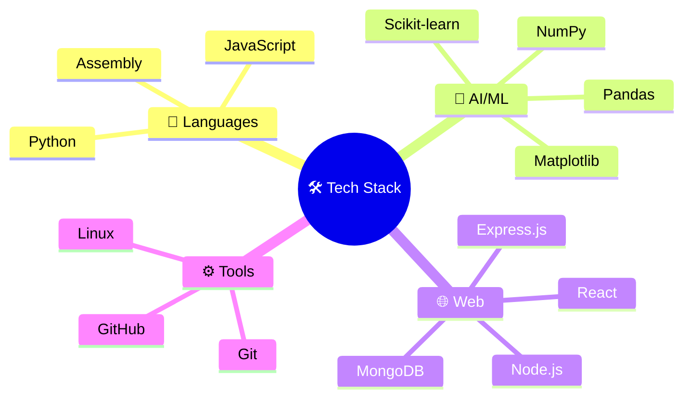

````markdown
# 👋 Hey there! I'm **B M Rauf**

<div align="center">

[](https://git.io/typing-svg)

*Building secure, transparent, and ethical AI systems for a better tomorrow* 🌟

[](https://www.bmrauf.me)
[](https://www.linkedin.com/in/mebmrauf)
[](mailto:bmrauf.me@gmail.com)

</div>

---

## 🎯 About Me

```yaml
name: B M Rauf
role: CSE Student & Future Cybersecurity Researcher
location: Dhaka, Bangladesh 🇧🇩
university: BRAC University
focus_areas:
  - Explainable AI (XAI)
  - Ethical AI Systems
  - Cybersecurity
  - Machine Learning Security
thesis_topic: Machine Learning for Cybersecurity
philosophy: Technology should be secure, transparent, and ethical
````

🔍 **Current Focus**

* 🛡️ Cybersecurity Research
* 🧠 Explainable AI
* ⚖️ Ethical AI
* 🚀 Continuous Learning

---

## 🛠️ Tech Arsenal



---

## 🎯 Specialized Focus Areas

<div align="center">


</div>

---

## 🌟 Fun Facts About Me

<table align="center">
<tr>
<td align="center" width="20%">

🚗 **Car Enthusiast**
*Love automotive tech*

</td>
<td align="center" width="20%">

🌱 **Gardening**
*Growing green!*

</td>
<td align="center" width="20%">

👟 **Sneaker Collector**
*Style meets comfort*

</td>
<td align="center" width="20%">

⌚ **Watch Enthusiast**
*Time is precious*

</td>
<td align="center" width="20%">

😴 **Professional Sleeper**
*Rest = Best code!*

</td>
</tr>
</table>

---

## 🚀 Featured Projects

| 🔒 Security & AI                                                                                                                                                                                                 | 🌐 Web Dev                                                                                                                                                                   | 🎮 Creative                                                                                                                                                                              |
| ---------------------------------------------------------------------------------------------------------------------------------------------------------------------------------------------------------------- | ---------------------------------------------------------------------------------------------------------------------------------------------------------------------------- | ---------------------------------------------------------------------------------------------------------------------------------------------------------------------------------------- |
| [](https://github.com/mebmrauf/Air-Quality-Predictor) | [](https://github.com/mebmrauf/UngaBunga) | [](https://github.com/mebmrauf/3D-Snake-Game) |

---

## 🔍 Project Highlights

* 🤖 **[Air Quality Predictor](https://github.com/mebmrauf/Air-Quality-Predictor)**
  ML model to monitor air quality
  `Python`, `Scikit-learn`, `Matplotlib`

* 🛒 **[UngaBunga](https://github.com/mebmrauf/UngaBunga)**
  Secure grocery delivery platform
  `MERN Stack`, `Tailwind CSS`

* 🎮 **[3D Snake Game](https://github.com/mebmrauf/3D-Snake-Game)**
  3D gaming experience using `PyOpenGL`
  `Python`, `GLUT`, `OpenGL`

---

## 📊 GitHub Analytics

<div align="center">

<table>
<tr>
<td>

### 📈 Stats


</td>
<td>

### 🔥 Streak


</td>
</tr>
</table>

### 🧠 Top Languages


### 📈 Contribution Activity


### 🏆 GitHub Trophies


</div>

---

## 🎓 Academic Journey

**🏛️ BRAC University** — *BSc in CSE*
📅 Sep 2022 – Present
🔬 Thesis: *Machine Learning for Cybersecurity*

### 📚 Research Interests

* XAI in Security Systems
* ML-based Threat Detection
* Privacy-Preserving AI
* Ethical AI Governance

---

## 🏆 Leadership & Impact

**🌟 Founding Member – EK JUBO SONGHO**
📅 Jan 2022 – Present

* 🧩 Organized 20+ members
* 📈 Led fundraising & strategy
* 💬 Grew leadership & community ties

---

## 💫 Core Values & Skills

<table>
<tr>
<td>

### 🛡️ Security Mindset

```
🔐 Threat Analysis  
🛡️ Risk Assessment  
🔍 Vulnerability Scanning  
⚡ Incident Response  
📊 Security Analytics
```

</td>
<td>

### 🧠 AI Ethics & XAI

```
⚖️ Fairness & Accountability  
📋 Bias Detection  
📊 Explainability  
🔍 Model Transparency  
🤝 Responsible AI
```

</td>
<td>

### 💻 Tech Skills

```
🐍 Python  
🤖 ML Engineering  
🌐 Full-Stack Dev  
📊 Data Science  
🔧 System Design
```

</td>
</tr>
</table>

---

## 🌐 Global Communication

<div align="center">


</div>

---

## 🔗 Let's Connect!

<div align="center">


### ⭐ Like what you see?

> *Star my repositories and let's build the future of ethical AI and cybersecurity together!* 🚀

</div>
```
