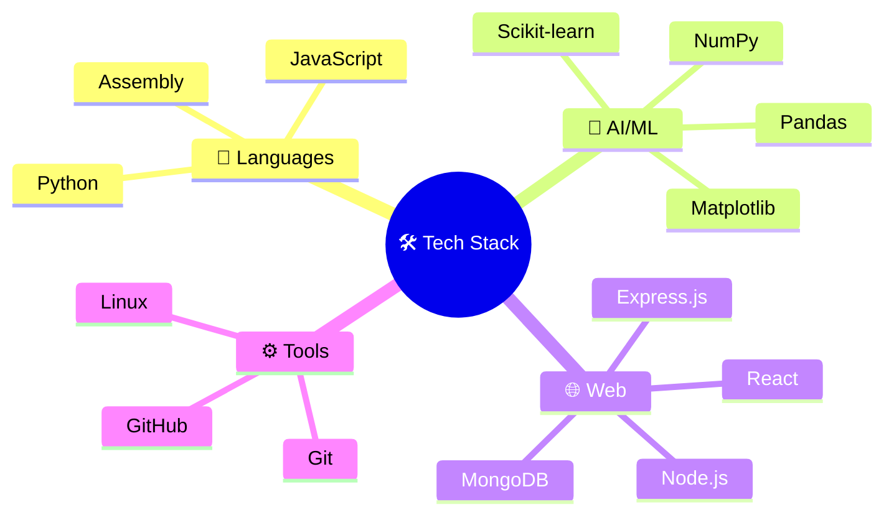

---

### 🌟 **Fun Facts About Me**

<div align="center">

<table>
<tr>
<td align="center" width="20%">
<div style="background: linear-gradient(135deg, #FF6B6B, #FF8E8E); padding: 15px; border-radius: 50%; color: white; margin: 10px;">
<h3>🚗</h3>
<strong>Car Enthusiast</strong><br/>
<small>Love automotive tech</small>
</div>
</td>
<td align="center" width="20%">
<div style="background: linear-gradient(135deg, #4ECDC4, #44A08D); padding: 15px; border-radius: 50%; color: white; margin: 10px;">
<h3>🌱</h3>
<strong>Gardening</strong><br/>
<small>Growing green!</small>
</div>
</td>
<td align="center" width="20%">
<div style="background: linear-gradient(135deg, #45B7D1, #96CEB4); padding: 15px; border-radius: 50%; color: white; margin: 10px;">
<h3>👟</h3>
<strong>Sneaker Collector</strong><br/>
<small>Style meets comfort</small>
</div>
</td>
<td align="center" width="20%">
<div style="background: linear-gradient(135deg, #F7DC6F, #F4D03F); padding: 15px; border-radius: 50%; color: white; margin: 10px;">
<h3>⌚</h3>
<strong>Watch Enthusiast</strong><br/>
<small>Time is precious</small>
</div>
</td>
<td align="center" width="20%">
<div style="background: linear-gradient(135deg, #BB8FCE, #D7BDE2); padding: 15px; border-radius: 50%; color: white; margin: 10px;">
<h3>😴</h3>
<strong>Professional Sleeper</strong><br/>
<small>Rest = Best code!</small>
</div>
</td>
</tr>
</table>

</div>

---

<div align="center">

### 🌟 **Call to Action**

<div style="background: linear-gradient(135deg, #667eea 0%, #764ba2 100%); padding: 25px; border-radius: 20px; color: white; text-align: center; margin: 20px 0; box-shadow: 0 12px 40px rgba(102, 126, 234, 0.3);">

**⭐ Found something interesting? Star my repositories!**

*Building a secure and ethical digital future, one commit at a time* 🛡️✨

**Let's collaborate on making AI more explainable and cybersecurity more robust!**

</div>


</div># 👋 Hey there! I'm **B M Rauf**

<div align="center">

[](https://git.io/typing-svg)

*Building secure, transparent, and ethical AI systems for a better tomorrow* 🌟

[](https://www.bmrauf.me)
[](https://www.linkedin.com/in/mebmrauf)
[](mailto:bmrauf.me@gmail.com)

</div>

---

## 🎯 **About Me**

```yaml
name: B M Rauf
role: CSE Student & Future Cybersecurity Researcher
location: Dhaka, Bangladesh 🇧🇩
university: BRAC University
focus_areas: 
  - Explainable AI (XAI)
  - Ethical AI Systems
  - Cybersecurity
  - Machine Learning Security
thesis_topic: "Machine Learning for Cybersecurity"
philosophy: "Technology should be secure, transparent, and ethical"
```

🔍 **Current Focus:**
- 🛡️ **Cybersecurity Research**: Exploring ML-driven security solutions
- 🧠 **Explainable AI**: Making AI decisions transparent and interpretable  
- ⚖️ **Ethical AI**: Ensuring AI systems are fair, accountable, and trustworthy
- 🚀 **Continuous Learning**: Always exploring new frontiers in tech

---

## 🛠️ **Tech Arsenal**

<div align="center">



</div>

<table align="center">
<tr>
<td align="center" width="25%">

### 🐍 **Languages**


</td>
<td align="center" width="25%">

### 🤖 **AI/ML & Security**


</td>
<td align="center" width="25%">

### 🌐 **Web Development**


</td>
<td align="center" width="25%">

### ⚙️ **Tools & Platforms**


</td>
</tr>
</table>

<div align="center">

### 🎯 **Specialized Focus Areas**


</div>

---

## 🚀 **Featured Projects**

<div align="center">

| 🔒 **Security & AI** | 🌐 **Web Development** | 🎮 **Creative Projects** |
|:---:|:---:|:---:|
| [](https://github.com/mebmrauf/Air-Quality-Predictor) | [](https://github.com/mebmrauf/UngaBunga) | [](https://github.com/mebmrauf/3D-Snake-Game) |

</div>

### 🔍 **Project Highlights**

🤖 **[Air Quality Predictor](https://github.com/mebmrauf/Air-Quality-Predictor)**
- *Machine Learning model for environmental monitoring*
- **Tech Stack:** Python, Scikit-learn, Pandas, Matplotlib
- **Focus:** Data-driven environmental solutions

🛒 **[UngaBunga](https://github.com/mebmrauf/UngaBunga)**  
- *Secure local grocery delivery platform*
- **Tech Stack:** MERN Stack, Tailwind CSS
- **Focus:** E-commerce security and user experience

🎮 **[3D Snake Game](https://github.com/mebmrauf/3D-Snake-Game)**
- *Interactive 3D gaming experience*
- **Tech Stack:** Python, PyOpenGL, GLUT
- **Focus:** Computer graphics and game development

---

## 📊 **GitHub Analytics**

<div align="center">

### 🔥 **Performance Dashboard**

<table>
<tr>
<td align="center">
<h4>📈 Overall Statistics</h4>

</td>
<td align="center">
<h4>🔥 Contribution Streak</h4>

</td>
</tr>
</table>

<div style="margin: 20px 0;">

### 💻 **Language Proficiency**


</div>

### 📈 **Contribution Activity**


### 🏆 **GitHub Trophies**


</div>

---

## 🎓 **Academic Journey**

**🏛️ BRAC University** | *BSc in Computer Science and Engineering*  
📅 September 2022 – Present  
🔬 **Thesis Focus:** Machine Learning for Cybersecurity  

**📚 Research Interests:**
- Explainable AI in Security Systems
- Ethical AI Framework Development
- ML-based Threat Detection
- Privacy-Preserving Machine Learning

---

## 🏆 **Leadership & Impact**

**🌟 Founding Member – EK JUBO SONGHO**  
📅 January 2022 – Present
- 👥 Established organizational structure for 20+ member youth organization
- 💰 Led fundraising initiatives and strategic planning
- 🤝 Developed leadership and community coordination skills

---

## 💫 **Core Values & Skills**

<div align="center">

<table>
<tr>
<td width="33%" align="center">

### 🛡️ **Security Mindset**
```
┌─────────────────────────┐
│  🔐 Threat Analysis     │
│  🛡️ Risk Assessment     │
│  🔍 Vulnerability Scan  │
│  ⚡ Incident Response   │
│  📊 Security Analytics  │
└─────────────────────────┘
```

</td>
<td width="33%" align="center">

### 🧠 **AI Ethics & XAI**
```
┌─────────────────────────┐
│  ⚖️ Ethical Framework   │
│  🔍 Model Transparency  │
│  📋 Bias Detection      │
│  📊 Explainability      │
│  🤝 Responsible AI      │
└─────────────────────────┘
```

</td>
<td width="33%" align="center">

### 💻 **Technical Skills**
```
┌─────────────────────────┐
│  🐍 Python Mastery      │
│  🤖 ML Engineering      │
│  🌐 Full-Stack Dev      │
│  📊 Data Science        │
│  🔧 System Design       │
└─────────────────────────┘
```

</td>
</tr>
</table>

### 🌟 **Soft Skills Spectrum**

<table>
<tr>
<td align="center" width="20%">
<div style="background: linear-gradient(135deg, #667eea 0%, #764ba2 100%); padding: 15px; border-radius: 10px; color: white; margin: 5px;">
<strong>🎯 Leadership</strong><br/>
<small>Strategic Planning<br/>Team Coordination</small>
</div>
</td>
<td align="center" width="20%">
<div style="background: linear-gradient(135deg, #f093fb 0%, #f5576c 100%); padding: 15px; border-radius: 10px; color: white; margin: 5px;">
<strong>🤝 Collaboration</strong><br/>
<small>Team Player<br/>Active Listening</small>
</div>
</td>
<td align="center" width="20%">
<div style="background: linear-gradient(135deg, #4facfe 0%, #00f2fe 100%); padding: 15px; border-radius: 10px; color: white; margin: 5px;">
<strong>💡 Innovation</strong><br/>
<small>Critical Thinking<br/>Problem Solving</small>
</div>
</td>
<td align="center" width="20%">
<div style="background: linear-gradient(135deg, #43e97b 0%, #38f9d7 100%); padding: 15px; border-radius: 10px; color: white; margin: 5px;">
<strong>📚 Learning</strong><br/>
<small>Adaptability<br/>Growth Mindset</small>
</div>
</td>
<td align="center" width="20%">
<div style="background: linear-gradient(135deg, #fa709a 0%, #fee140 100%); padding: 15px; border-radius: 10px; color: white; margin: 5px;">
<strong>🗣️ Communication</strong><br/>
<small>Multilingual<br/>Technical Writing</small>
</div>
</td>
</tr>
</table>

### 🌍 **Global Communication**
<div style="display: flex; justify-content: center; gap: 20px; margin: 20px 0;">


</div>

</div>

---

## 🔗 **Let's Connect!**

<div align="center">

### 🌐 **Professional Network**

<table>
<tr>
<td align="center">

#### 💼 **Professional**
<div style="display: flex; flex-direction: column; gap: 8px;">
<a href="https://www.linkedin.com/in/mebmrauf">

</a>
<a href="mailto:bmrauf.me@gmail.com">

</a>
<a href="https://www.bmrauf.me">

</a>
</div>

#### 💻 **Coding Platforms**
<div style="display: flex; flex-direction: column; gap: 8px;">
<a href="https://leetcode.com/mebmrauf">

</a>
<a href="https://www.hackerrank.com/profile/mebmrauf">

</a>
<a href="https://codeforces.com/profile/bmrauf">

</a>
</div>

</td>
<td align="center">

#### 📱 **Social & Messaging**
<div style="display: flex; flex-direction: column; gap: 8px;">
<a href="https://www.facebook.com/mebmrauf">

</a>
<a href="https://www.instagram.com/mebmrauf">

</a>
<a href="https://twitter.com/mebmrauf">

</a>
<a href="https://t.me/mebmrauf">

</a>
<a href="https://wa.link/b6gwse">

</a>
</div>

</td>
</tr>
</table>

### 📞 **Quick Contact**
<table align="center">
<tr>
<td align="center" style="border: 2px solid #4ECDC4; border-radius: 15px; padding: 20px; background: linear-gradient(135deg, #667eea 0%, #764ba2 100%); color: white;">
<h4>📧 Primary Contact</h4>
<strong>bmrauf.me@gmail.com</strong><br/>
<small>Response within 24 hours</small>
</td>
<td align="center" style="border: 2px solid #FF6B6B; border-radius: 15px; padding: 20px; background: linear-gradient(135deg, #f093fb 0%, #f5576c 100%); color: white;">
<h4>📱 Phone</h4>
<strong>+880 1726-339233</strong><br/>
<small>Available 9 AM - 9 PM (GMT+6)</small>
</td>
</tr>
</table>

---

### 🤝 **Let's Collaborate On**


</div>

---

## 💭 **Philosophy & Inspiration**

<div align="center">

### 🌟 **Guiding Principles**

<table>
<tr>
<td align="center" width="50%">

<div style="background: linear-gradient(135deg, #667eea 0%, #764ba2 100%); padding: 25px; border-radius: 20px; color: white; box-shadow: 0 8px 32px rgba(102, 126, 234, 0.3);">

#### 🛡️ **Security Philosophy**

> *"In cybersecurity, transparency isn't just preferred—it's the foundation of trust. When AI makes decisions that affect security, we must be able to understand and explain every step."*

**— B M Rauf**

---

*Building systems that are secure by design, transparent by default*

</div>

</td>
<td align="center" width="50%">

<div style="background: linear-gradient(135deg, #f093fb 0%, #f5576c 100%); padding: 25px; border-radius: 20px; color: white; box-shadow: 0 8px 32px rgba(245, 87, 108, 0.3);">

#### ⚖️ **Ethics in Technology**

> *"The most powerful technologies require the strongest ethical foundations. AI should amplify human potential while preserving human dignity."*

**— Inspired by AI Ethics Research**

---

*Technology with purpose, innovation with responsibility*

</div>

</td>
</tr>
</table>

### 🎯 **Core Motivations**

<div style="display: flex; justify-content: center; gap: 20px; margin: 30px 0;">

<div style="background: linear-gradient(135deg, #4facfe 0%, #00f2fe 100%); padding: 20px; border-radius: 15px; color: white; text-align: center; min-width: 200px;">
<h4>🔍 Research Drive</h4>
<em>"Every algorithm should be as explainable as it is powerful"</em>
</div>

<div style="background: linear-gradient(135deg, #43e97b 0%, #38f9d7 100%); padding: 20px; border-radius: 15px; color: white; text-align: center; min-width: 200px;">
<h4>🌱 Growth Mindset</h4>
<em>"Learning never stops, especially in security"</em>
</div>

<div style="background: linear-gradient(135deg, #fa709a 0%, #fee140 100%); padding: 20px; border-radius: 15px; color: white; text-align: center; min-width: 200px;">
<h4>🤝 Collaboration</h4>
<em>"Best solutions emerge from diverse perspectives"</em>
</div>

</div>

### 📜 **Wisdom from the Masters**

<table>
<tr>
<td align="center">

<div style="border-left: 4px solid #667eea; padding: 20px; background: rgba(102, 126, 234, 0.1); border-radius: 10px; margin: 10px;">

> *"It's not at all important to get it right the first time. It's vitally important to get it right the last time."*

**— Andrew Hunt & David Thomas**  
*The Pragmatic Programmer*

</div>

</td>
</tr>
<tr>
<td align="center">

<div style="border-left: 4px solid #f093fb; padding: 20px; background: rgba(240, 147, 251, 0.1); border-radius: 10px; margin: 10px;">

> *"The best way to find out if you can trust somebody is to trust them."*

**— Ernest Hemingway**

</div>

</td>
</tr>
<tr>
<td align="center">

<div style="border-left: 4px solid #43e97b; padding: 20px; background: rgba(67, 233, 123, 0.1); border-radius: 10px; margin: 10px;">

> *"Research is tough, and motivation is crucial; working on something you genuinely find interesting will keep you engaged and excited."*

**— Research Community Wisdom**

</div>

</td>
</tr>
</table>

### 🎯 **Personal Manifesto**

<div style="background: linear-gradient(135deg, #667eea 0%, #764ba2 100%); padding: 30px; border-radius: 20px; color: white; text-align: center; margin: 20px 0; box-shadow: 0 12px 40px rgba(102, 126, 234, 0.3);">

**"Building Tomorrow's Security with Today's Ethics"**

*I believe in creating technology that not only protects and serves but does so transparently and ethically. Every line of code I write, every model I train, and every system I design should contribute to a more secure, transparent, and equitable digital future.*

---

⭐ **My Commitment:** Making AI explainable, security transparent, and technology ethical

</div>

</div>

---

<div align="center">


</div>
